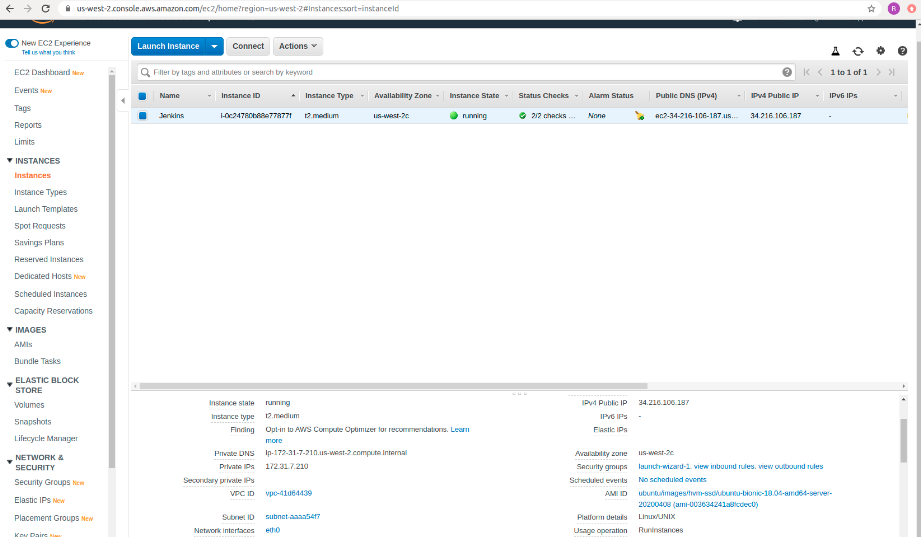
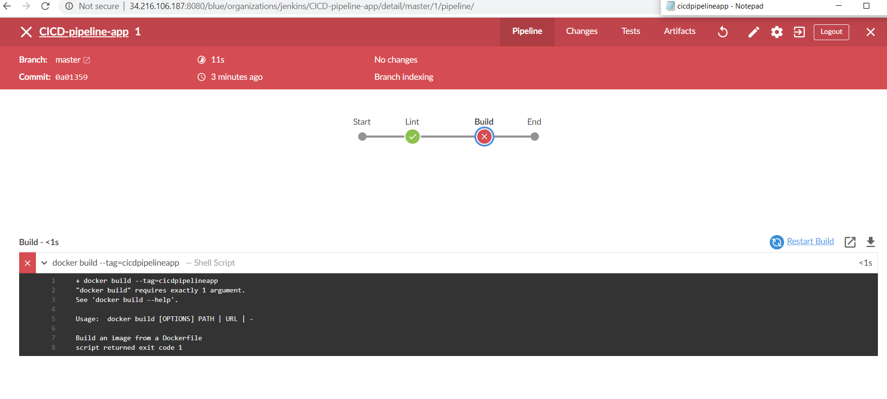
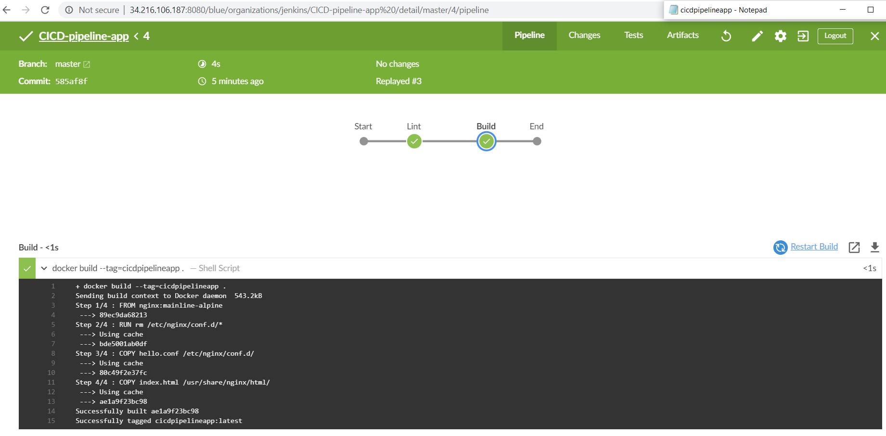
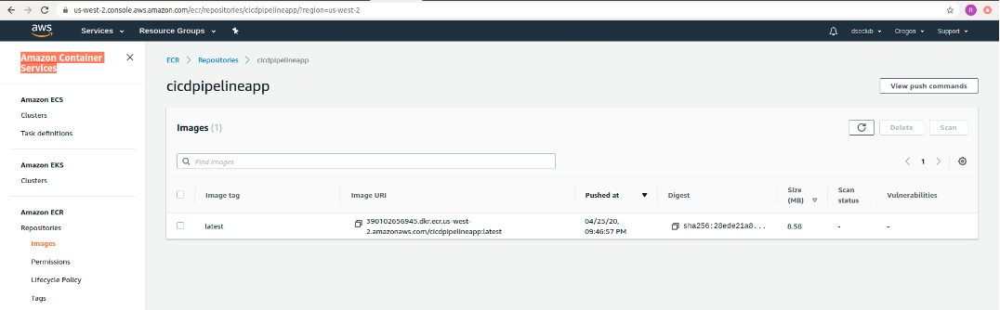
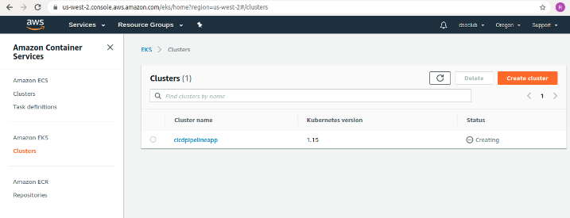
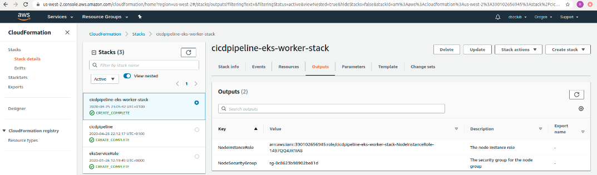
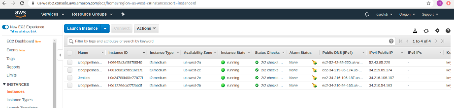
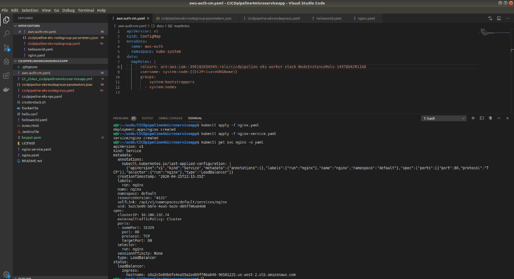
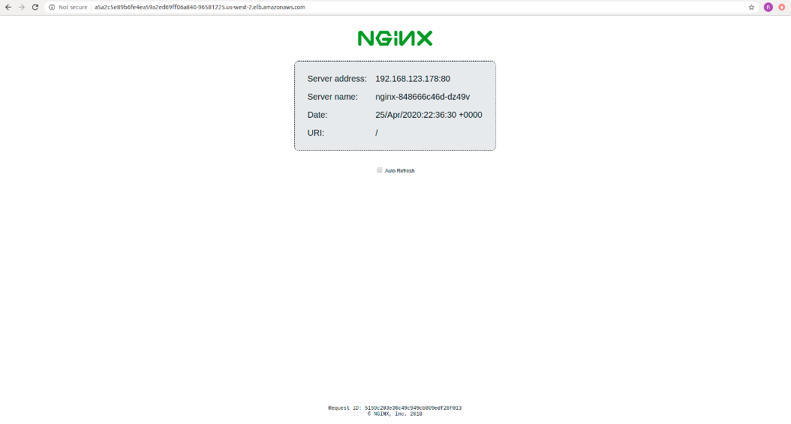

# Final project of Udacity DevOps Nanodegree

## Project Description
Develop a CICD pipeline for microservice application with rolling deployment. Start with a linting check, built Docker container, push the built Docker container to the Amazon Elastic Container Registry ECR, and then deploy these Docker container to a Kubernetes cluster.

## Learning Objectives
- Setting up Jenkins
- Configuring Jenkins with the required plugins
- Pushing Docker images to an private ECR Instance
- Pull Docker image from the private ECR Instance
- Deploy those images through kubernetes


## Steps in Completing this Project

1: Propose and Scope the Project

- Plan what your project will look like.
- Decide which options you will include in your Continuous Integration and Continuous Deployment.
- Pick a deployment type - Rolling deployment

2: Setting up environment.

- Lauch a AWS EC2 instance  AMI: Ubuntu Server 18.04 LTS  t2.medium



- Install required dependencies
- Jenkins and required plugins in Jenkins (Blue Ocean, Pipeline AWS steps, Amazon ECR)
- Docker
- AWS CLI
- eksctl
- kubectl
- lint
- tidy

3: Build your Jenkins pipeline

- Construct your pipeline in your GitHub repository.
- Set up all the steps that your pipeline will include.
- Configure a pipeline.

Jenkins pipeline Build stage failed. 



Jenkins pipeline Build stage Passed.

Code is checked against a linter as part of a Continuous Integration step. 

The project takes a Dockerfile and creates a Docker container in the pipeline.



4: Build Kubernetes cluster.

- Docker image in ECR



- Kubernetes Cluster EKS in EKS



- CloudFormations to build Kubernetes Cluster, Configure worker nodes.




- Three EC2 - worker nodes created




5: Launching nginx web app inside the Kubernetes cluster

```
kubectl apply -f nginx.yaml
kubectl apply -f nginx-service.yaml
kubectl get svc nginx -o yaml
```

6: Details of deployed nginx web app in the Kubernetes cluster. 



7: Testing deployed web application

The web application is a simple static site running in an nginx container exposing port 80.




